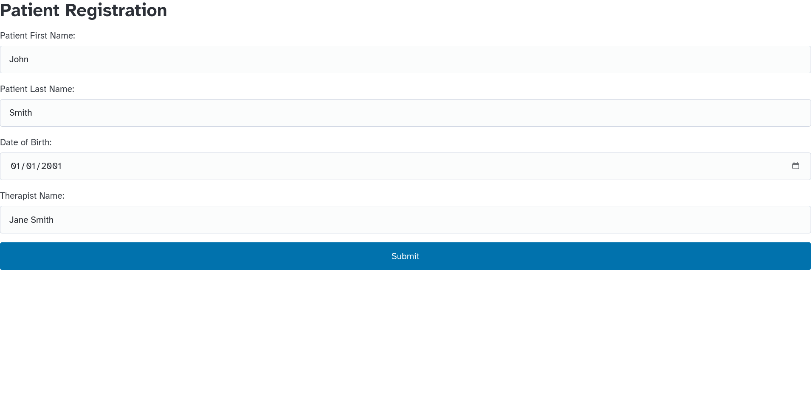
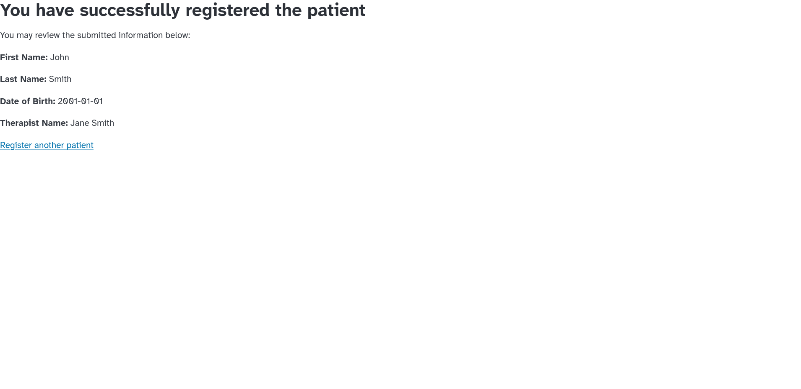

# Flask patient registration demo

## Table of contents

<!-- mtoc-start -->

- [Screenshots](#screenshots)
- [Features](#features)
- [Overview](#overview)
- [Running the app](#running-the-app)
- [Considerations for production](#considerations-for-production)

<!-- mtoc-end -->

## Screenshots






## Features

- Patient registration form with validation.
- Structured Query Language (SQL) database support with SQLite.
- Confirmation page with entered data.
- Responsive and minimal browser styling with
  [pico.css](https://github.com/picocss/pico).

## Overview

This Flask code demonstrates full-stack app development skills.

The app permits a user to enter data into a form. The data includes:

- Patient's first name
- Patient's last name
- Patient's date of birth
- Therapist name

Once the user enters the data and sends the POST request to the
`/submit` endpoint, the app validates the form data. The client-side
checks that the user populated all the forms with data, and that the
date of birth precedes the current date. Since a tool like Burp Suite
can turn off client-side validation, the server performs these checks as
well.

After the app validates the data, it writes it to a SQLite database.
Then the app redirects to a confirmation page. The confirmation page
displays the entered data and a link to add another patient.

## Running the app

Install Python if not already present, along with the `pip` package
manager. Then perform these steps.

1. Create a virtual environment to confine package installation to
   this project.

```shell
$ python3 -m venv venv
```

2. Activate the virtual environment. You must choose the appropriate
   activation file for the interactive shell you use. This examples uses
   the `fish` shell's activation file.

```shell
$ . venv/bin/activate.fish
```

3. Install required packages.

```shell
$ pip install -r requirements.txt
```

4. Run the app.

```shell
$ flask --app app run
 * Serving Flask app 'app'
 * Debug mode: off
WARNING: This is a development server. Do not use it in a production deployment. Use a production WSGI server instead.
 * Running on http://127.0.0.1:5000
Press CTRL+C to quit

```

5. Use your browser to visit the Uniform Resource Locator (URL) printed
   in Flask's output.

```shell
$ firefox http://127.0.0.1:5000
```

6. Once you finish viewing the demo, remember to exit the virtual environment.

```shell
$ deactivate
```

## Considerations for production

As this code represents a proof of concept, it lacks many safeguards and
features expected in production. Some examples include:

- Stricter validation logic (for example: a character allowlist and
  enforced formats).
- Sandboxing.
- Production Web Server Gateway Interface (WSGI) server instead of the
  built-in Flask server. Flask explicitly warns not to use the built-in
  server for production.
- HyperText Transport Protocol Secure (HTTPS) support. [See Request For
  Comments (RFC) 9325](https://datatracker.ietf.org/doc/rfc9325) for more
  details on secure configuration.
- Patient management kept behind a login, and therapists can only manage
  their own patients.
- Fine-grained access controls with a robust security model from the
  start.
- Secure deployment on a server that meets Health Insurance
  Portability and Accountability Act (HIPAA) requirements.
- A different database with both encryption at rest and concurrent write
  capabilities, such as PostgreSQL.
- The code initializes the database at the module level---not a good
  practice, but it works for a basic demo.
